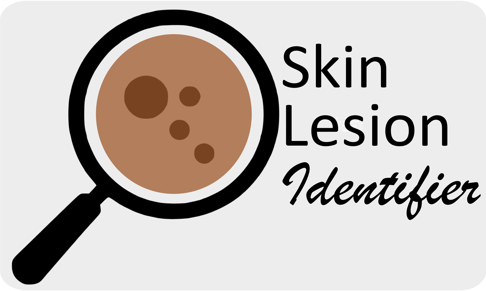
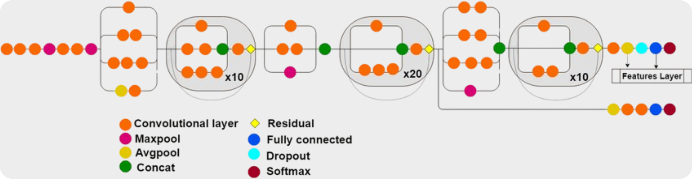
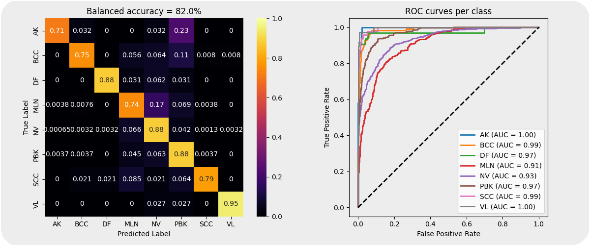

# Skin Lesion Identifier

<h2 align="center">
    
</h2>

Skin lesion identifier is an application that classifies images of spots on the skin into 8 categories of common skin lesion types, using a large convolutional neural network. This app was built with the intent to perform well for everyone, including people of color. 

Note that no model is bias-free, as some bias will be inherent to the data on which the model was trained. The current model is only one step in the right direction, and by no means an unbiassed model.

This is not a diagnostic tool. Do not use it to diagnose your own skin lesions. With that in mind, feel free to try out the app here:

[](https://skin-lesion-prediction.streamlit.app/)

In the webapp there is the option to try three different models. Information about the individual models is available in the 'about' page (under model technical information).

### Data sources

The training data consisted of both dermatoscopic and non-dermatoscopic images, and with a range of skin tones. 

[Stanford Diverse Dermatology images](https://ddi-dataset.github.io/index.html#dataset), [publication](https://www.science.org/doi/full/10.1126/sciadv.abq6147)
\
[ISIC 2019 challenge](https://api.isic-archive.com/collections/65/), [description](https://challenge.isic-archive.com/landing/2019/)\
[HAM10000](https://api.isic-archive.com/collections/212/), [publication](https://www.nature.com/articles/sdata2018161#MOESM246)

### Diagnosis categories

`Actinic keratosis (AK)` is a rough, scaly patch on the skin caused by years of sun exposure. It is considered precancerous, as it can potentially evolve into squamous cell carcinoma if left untreated.

`Basal cell carcinoma (BCC)` is the most common type of skin cancer, typically caused by long-term sun exposure. It grows slowly and rarely spreads to other parts of the body, but early treatment is recommended to prevent local tissue damage.

`Dermatofibroma (DF)` is a benign skin growth, usually firm and raised, often resulting from a minor injury like a bug bite. It’s generally harmless and does not require treatment unless it becomes symptomatic or bothersome.

`Melanoma (MLN)` is a highly aggressive form of skin cancer that arises from melanocytes, the cells responsible for skin pigmentation. It has a high potential to spread to other organs, making early detection and treatment critical for a good prognosis.

`Nevus (NV)`, or mole, is a common benign skin lesion caused by clusters of melanocytes. While most nevi are harmless, some may undergo changes that necessitate monitoring for melanoma risk.

`Pigmented benign keratosis (PBK)`, such as seborrheic keratosis, is a common non-cancerous skin growth that appears as a brown, black, or pale patch. These lesions are typically harmless and do not require treatment unless for cosmetic reasons or irritation.

`Squamous cell carcinoma (SCC)`, is a type of skin cancer that develops from the squamous cells of the epidermis. It can grow and spread if untreated, but it is generally curable when caught early.

`Vascular lesion (VL)` is an abnormality of the skin or mucous membranes caused by blood vessels, including conditions like hemangiomas and cherry angiomas. Most vascular lesions are benign and often do not require treatment unless for cosmetic purposes or if symptomatic.

### About the winning model:

Code for training the model is included in this repository. Some information on the winning model and its performance:

Model architecture ([image source](https://www.researchgate.net/figure/Schematic-diagram-compressed-view-of-InceptionResNetv2-model_fig5_348995187)):


Model performance on test-set:



### **Installation on `macOS`**: 


- Install the virtual environment and the required packages:

    ```BASH
    pyenv local 3.11.3
    python -m venv .venv
    source .venv/bin/activate
    pip install --upgrade pip
    pip install -r requirements.txt
    ```
### **Installation on `WindowsOS`**:

- Install the virtual environment and the required packages:

   For `PowerShell` CLI :

    ```PowerShell
    pyenv local 3.11.3
    python -m venv .venv
    .venv\Scripts\Activate.ps1
    python -m pip install --upgrade pip
    pip install -r requirements.txt
    ```

    For `Git-Bash` CLI :

  ```BASH
    pyenv local 3.11.3
    python -m venv .venv
    source .venv/Scripts/activate
    python -m pip install --upgrade pip
    pip install -r requirements.txt
    ```